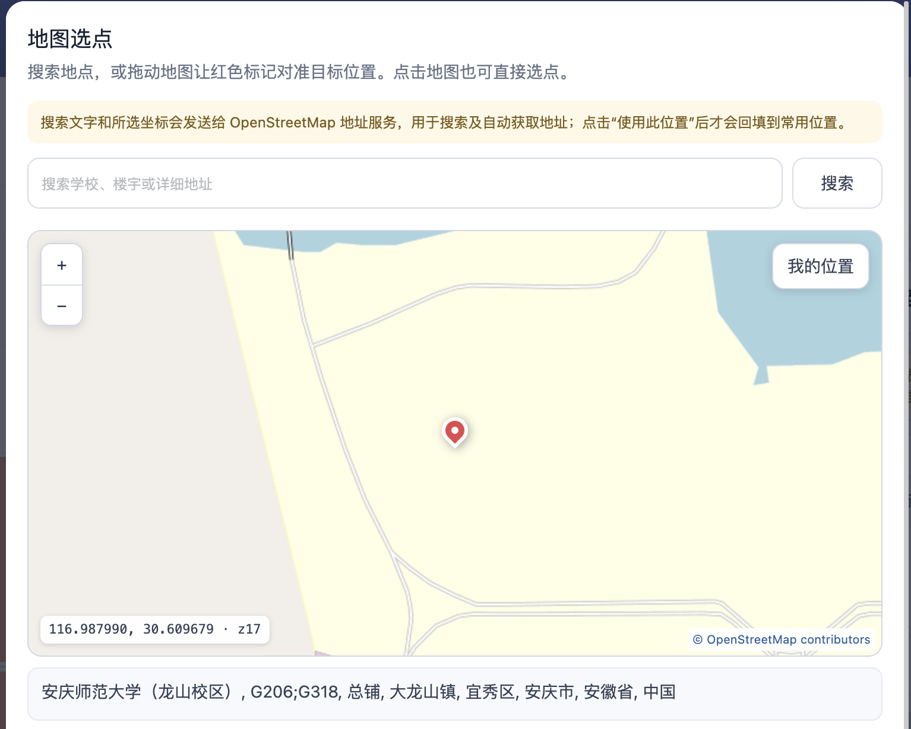

# 超星学习通签到助手

[](https://github.com/wguanfengyue/chaoxing-sign-helper/actions/workflows/test.yml)
[](https://github.com/wguanfengyue/chaoxing-sign-helper/releases/latest)
[](LICENSE)

一个直接运行在超星网页里的签到辅助脚本。登录超星后即可读取当前账号的签到活动，并根据首页课表在上课、下课前后自动检测和提醒。

脚本不会自动提交签到。每次操作都由用户打开、核对并确认；位置签到会进入超星官方定位页面。

**[安装脚本](https://raw.githubusercontent.com/wguanfengyue/chaoxing-sign-helper/main/signscript.user.js)** · [下载最新版](https://github.com/wguanfengyue/chaoxing-sign-helper/releases/latest) · [反馈问题](https://github.com/wguanfengyue/chaoxing-sign-helper/issues)

## 主要功能

- **免输账号密码**：直接使用浏览器中已经登录的超星账号，不需要复制 Cookie。
- **自动查找签到**：一次检查所有已绑定的网络课程，集中显示正在进行的签到活动。
- **按课表定时检测**：从超星首页读取本周课表，自由选择课程和检测时间。
- **系统通知提醒**：发现新签到后发送通知，并突出右下角的签到助手入口。
- **地图选点**：支持搜索地点、拖动地图、点击选点和浏览器定位，并自动获取文字地址。
- **常用位置**：位置名称、坐标和地址只保存在本机，方便下次查看和核对。
- **提交前确认**：展示课程、活动类型和填写内容，避免误点或重复提交。
- **结果判断**：只有服务器明确返回成功时才显示“签到成功”。

## 功能展示

### 按课表定时检测

不用每天手动输入时间。脚本读取超星首页课表后，可以选择需要关注的课程，并分别设置提前时间、延后时间和检测间隔。默认会在每次上课开始和下课结束的前后各 10 分钟内检测。

<p align="center">
  
</p>

只有带有效课程 ID 和班级 ID、已绑定超星网络课程的项目可以选择。保持任意超星页面打开即可运行；电脑休眠、浏览器关闭或后台标签页被限速时，检测可能暂停或延迟。

### 地图选点并自动获取地址

可以搜索学校、楼宇或详细地址，也可以拖动地图、点击选点或使用浏览器当前位置。选定坐标后，脚本会通过 OpenStreetMap 地址服务获取对应的文字地址。

<p align="center">
  
</p>

### 保存常用位置

常用地点可以保存位置名称、经纬度和显示地址，数据只存放在当前浏览器的 Violentmonkey 或 Tampermonkey 中。地图预设用于查看和核对地点，位置签到仍由超星官方页面完成定位授权。

<p align="center">
  
</p>

## 安装方法

1. 安装 [Violentmonkey](https://violentmonkey.github.io/get-it/) 或 Tampermonkey。
2. Chrome 用户打开脚本管理器的扩展详情页，启用“允许用户脚本”。
3. 点击 **[安装脚本](https://raw.githubusercontent.com/wguanfengyue/chaoxing-sign-helper/main/signscript.user.js)**，在脚本管理器页面确认安装。
4. 正常登录超星，刷新页面。右下角出现“签到助手”即表示安装成功。

第一次使用时，脚本管理器可能要求允许访问以下域名：

- `mooc1-api.chaoxing.com`：读取课程。
- `mobilelearn.chaoxing.com`：读取活动和签到页面。
- `kb.chaoxing.com`：读取首页课表。
- `nominatim.openstreetmap.org`：搜索地点和获取地址。

## 使用方法

1. 在任意超星页面点击右下角“签到助手”。
2. 点击“读取当前账号的签到活动”。
3. 根据需要筛选普通、位置或旧版二维码签到。
4. 普通签到和旧版二维码需要填写并核对内容后确认提交；位置签到会打开超星官方定位页。
5. 如需提醒，打开“定时检测”，读取课表并勾选课程。

## 支持的签到类型

| 签到类型 | 使用方式 |
| --- | --- |
| 普通签到 | 核对活动后手动确认 |
| 位置签到 | 查看活动要求并进入超星官方定位页面 |
| 旧版二维码签到 | 输入当前二维码链接或 32 位 `enc` 后确认 |
| 新版 `SIGNIN:` 二维码 | 使用学习通官方客户端 |
| 验证码、人脸等额外校验 | 按超星官方页面或客户端提示完成 |

## 隐私说明

- 脚本不读取、显示或保存 Cookie、账号密码。
- 姓名和地址只有在用户主动勾选保存时才写入本机脚本存储。
- 坐标只有在用户主动保存常用位置时才会存储。
- 地点搜索和所选坐标会发送给 OpenStreetMap Nominatim，以完成搜索和地址反查。
- 最终签到结果以超星平台中的记录为准。网络异常或结果不明时，请先核对记录再操作。

## 开发与贡献

需要 Node.js 18 或更高版本：

```bash
npm test
npm run check
```

测试不会连接超星、地图服务或提交签到。参与开发前请阅读 [CONTRIBUTING.md](CONTRIBUTING.md)，版本变化见 [CHANGELOG.md](CHANGELOG.md)。

本项目是独立的浏览器用户脚本重写，产品思路来自 [ziiing-lx/signscript](https://github.com/ziiing-lx/signscript)。原项目未提供开源许可证，本项目没有复制其 Java 源代码。

## 开源许可

[MIT License](LICENSE)
